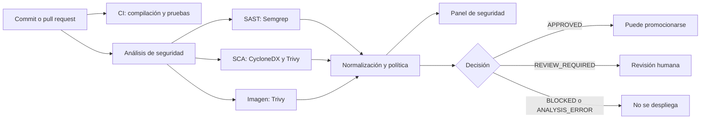

# Movie Review — caso de referencia DevSecOps

Aplicación Spring Boot sencilla para registrar películas y reseñas. Se utilizó como primer caso de estudio del TFM para construir y comprobar una *pipeline* DevSecOps asíncrona, el panel de seguridad y la remediación asistida por inteligencia artificial.

Este repositorio conserva el MVP y sirve como ejemplo reproducible. La herramienta destinada a preparar otros proyectos es el [Inicializador DevSecOps](https://github.com/CGARCHER/devsecops-learning-initializer).

## Qué permite comprobar

| Parte | Finalidad |
| --- | --- |
| Aplicación Spring Boot | Disponer de un proyecto real sobre el que compilar, probar y construir una imagen. |
| Integración continua | Comprobar el código y las pruebas sin esperar a los análisis de seguridad. |
| Análisis de seguridad | Revisar código, dependencias e imagen Docker con controles separados. |
| Política de seguridad | Decidir si una versión se aprueba, necesita revisión o debe bloquearse. |
| Panel local | Consultar los informes y entender cada hallazgo con más facilidad. |
| Remediación asistida | Obtener una explicación y, cuando hay contexto suficiente, una propuesta de cambio revisable. |

## Recorrido general



La integración continua y los análisis de seguridad se ejecutan de forma independiente. Así, un error de compilación se conoce sin esperar a que finalicen Semgrep y Trivy. Los resultados de seguridad se reúnen después para aplicar una única política.

## Requisitos

- Java 17.
- Maven Wrapper incluido en el repositorio.
- Docker y Docker Compose para ejecutar el entorno completo.
- Una cuenta de GitHub si se quieren consultar los informes desde el panel.

## Ejecutar solo la aplicación

Con H2 no hace falta preparar una base de datos externa:

```bash
./mvnw spring-boot:run
```

En Windows PowerShell:

```powershell
.\mvnw.cmd spring-boot:run
```

La aplicación queda disponible en <http://localhost:8080>. Los datos se almacenan en `./data`.

## Ejecutar el entorno completo con Docker

1. Copia `.env.example` como `.env` y cambia la contraseña local de PostgreSQL.
2. Crea la carpeta `.secrets`.
3. Añade el token de GitHub en `.secrets/github_token.txt`.
4. Si se va a probar la remediación, añade el token de la API en `.secrets/ai_api_token.txt`. Si no se utiliza, el fichero puede quedar vacío.
5. Inicia los servicios:

```bash
docker compose -f compose.local.yml up -d --build
```

| Servicio | Dirección local |
| --- | --- |
| Aplicación | <http://localhost:8080> |
| Panel de seguridad | <http://localhost:8081> |
| PostgreSQL | `localhost:5432` |

Si alguno de esos puertos ya está ocupado, debe detenerse el servicio anterior o cambiarse el puerto publicado en `compose.local.yml`.

### Ficheros Compose

- `compose.local.yml`: aplicación, PostgreSQL y panel de seguridad en el equipo del alumno.
- `compose.dev.yml`: aplicación, PostgreSQL y panel en el entorno `develop` de Dokploy.
- `compose.main.yml`: aplicación y PostgreSQL en producción, sin publicar el panel.

## Funcionalidad de la aplicación

- Alta y listado de películas.
- Año de estreno y género.
- Reseñas con autor, comentario y puntuación de 1 a 5.
- Media y número de reseñas por película.
- Interfaz web en `/`.
- Estado de salud en `/actuator/health`.

### API REST

```http
POST /api/movies
GET  /api/movies
GET  /api/movies/{id}
POST /api/movies/{id}/reviews
GET  /api/movies/{id}/reviews
```

Ejemplo de película:

```json
{"title":"Alien","releaseYear":1979,"genre":"Ciencia ficción"}
```

Ejemplo de reseña:

```json
{"author":"Alumno","rating":5,"comment":"Una película excelente"}
```

## Cómo funciona la pipeline

| Workflow | Qué hace |
| --- | --- |
| `.github/workflows/ci.yml` | Compila, ejecuta las pruebas y construye la imagen Docker. |
| `.github/workflows/security.yml` | Ejecuta SAST, SCA y análisis de la imagen; después normaliza los informes y aplica la política. |
| `.github/workflows/deploy-dokploy.yml` | Solicita manualmente el despliegue en Dokploy y exige `APPROVED` para producción. |

Antes de analizar, `security.yml` detecta la raíz de Spring Boot, Maven o Gradle, la versión de Java y el Dockerfile. También admite proyectos situados en un subdirectorio. Si encuentra varios módulos posibles, solicita `project_path` para no elegir uno de forma silenciosa.

### Controles de seguridad

| Control | Herramienta | Qué revisa |
| --- | --- | --- |
| SAST | Semgrep | Patrones inseguros en el código fuente. |
| SCA | CycloneDX y Trivy | Dependencias y versiones con vulnerabilidades conocidas. |
| Contenedor | Trivy | Paquetes incluidos en la imagen Docker final. |

CycloneDX genera el inventario de dependencias en formato SBOM. Trivy utiliza ese inventario para el análisis SCA y revisa por separado la imagen construida.

Los ejemplos vulnerables de `security-fixtures` solo sirven para comprobar que las herramientas detectan los casos esperados. No se compilan, no forman parte de la aplicación y sus resultados no intervienen en la decisión del proyecto real.

### Estados de la política

| Estado | Significado |
| --- | --- |
| `APPROVED` | Los informes son válidos y no existen hallazgos `HIGH` o `CRITICAL`. |
| `REVIEW_REQUIRED` | Existe al menos un hallazgo `HIGH` y debe revisarse antes de desplegar. |
| `BLOCKED` | Existe al menos un hallazgo `CRITICAL`. |
| `ANALYSIS_ERROR` | Falta un informe o un analizador no ha terminado correctamente. |

La ausencia de un informe nunca se interpreta como ausencia de vulnerabilidades. Producción exige expresamente el estado `APPROVED` para el mismo commit que se quiere desplegar.

## Panel de seguridad

El panel descarga el último artefacto `spring-boot-security-report-*` generado por GitHub Actions. Muestra el estado de la política, los datos del commit, el recuento por severidad y una tabla de hallazgos.

Para descargar informes necesita un token de GitHub limitado al repositorio y con permiso **Actions: Read**. La rama se configura mediante `GITHUB_BRANCH` en `.env`; por defecto se utiliza `develop`.

El botón **Explicar con IA** solicita una remediación educativa. El código fuente se monta en modo de solo lectura para aportar únicamente el contexto necesario. El panel muestra la propuesta, pero no modifica el proyecto ni aplica el parche.

La creación del token se explica en [`docs/github-token-para-informes.md`](docs/github-token-para-informes.md).

## Despliegue con Dokploy

El entorno `develop` utiliza `compose.dev.yml` y necesita:

```text
POSTGRES_PASSWORD=<contraseña de desarrollo>
GH_TOKEN=<token con Actions: Read>
```

El dominio del panel debe apuntar al puerto interno `8080` del servicio `security-dashboard`. En este entorno la remediación mediante IA está desactivada y el acceso al panel debe protegerse porque contiene información de seguridad.

Producción utiliza `compose.main.yml`. El workflow crea una etiqueta para el commit aprobado, configura esa etiqueta en Dokploy y solicita el despliegue por su API. Espera a que termine esa solicitud antes de comprobar la salud de la aplicación. La configuración se explica en [Despliegue en Dokploy](docs/despliegue-dokploy.md).

## Reutilización en otros proyectos

El workflow de seguridad puede utilizarse desde otro repositorio Spring Boot. No obstante, para una práctica educativa se recomienda usar el [Inicializador DevSecOps](https://github.com/CGARCHER/devsecops-learning-initializer), porque genera una copia autónoma con el workflow, las reglas, las guías y, de forma opcional, el panel local.

## Comprobaciones locales

```bash
./mvnw test
python -m unittest discover -s tests -v
docker build -t movie-review:local .
```

## Documentación relacionada

- [`docs/architecture.md`](docs/architecture.md): arquitectura del prototipo.
- [`docs/politica-seguridad.md`](docs/politica-seguridad.md): reglas utilizadas para tomar la decisión.
- [`SECURITY_SETUP.md`](SECURITY_SETUP.md): importación de los *rulesets* de GitHub.

## Repositorios del TFM

- [Inicializador DevSecOps](https://github.com/CGARCHER/devsecops-learning-initializer).
- [API de remediación educativa](https://github.com/CGARCHER/ai-remediation).

---

Creado por [CGARCHER](https://github.com/CGARCHER).

El panel local se publica únicamente en 127.0.0.1:8081. La política exige revisión para UNKNOWN y conserva una decisión ANALYSIS_ERROR cuando la configuración de la política no es válida.
