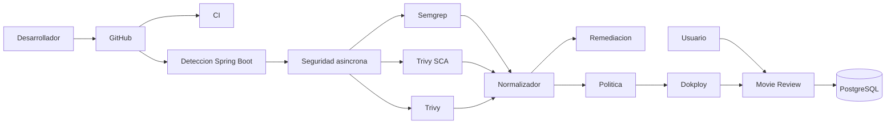

# Arquitectura del prototipo

La aplicacion es autonoma y no depende de servicios de negocio externos. En
local puede usar H2; en Dokploy se conectara a PostgreSQL mediante variables de
entorno.

La aplicacion de peliculas es el caso de validacion, pero no forma parte del
nucleo del analizador. El workflow detecta Maven o Gradle, la version de Java,
la raiz del proyecto y el Dockerfile. Esta version queda como referencia
funcional del MVP. La evolucion reutilizable se concentra en `DevSecOps
Learning Initializer`, que genera la configuracion necesaria para incorporar
el mismo flujo a proyectos Spring Boot existentes sin modificar el original.

Si no existe un Dockerfile unico, el analisis SAST y SCA continua y la
tecnologia de contenedores se registra como no aplicable. Si se detectan varios
proyectos Spring Boot, el proceso se detiene para que se indique `project_path`;
elegir un modulo de forma silenciosa podria producir un informe incorrecto.
