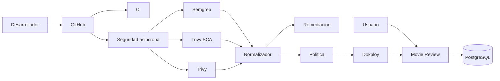

# Arquitectura inicial

```mermaid
flowchart LR
    U[Usuario] --> APP[Movie Review]
    APP --> DB[(PostgreSQL)]
    DEV[Desarrollador] --> GH[GitHub]
    GH --> CI[CI]
    GH --> SEC[Seguridad asincrona]
    SEC --> SAST[Semgrep]
    SEC --> SCA[Trivy SCA]
    SEC --> IMG[Trivy]
    SAST --> N[Normalizador]
    SCA --> N
    IMG --> N
    N --> AI[Remediacion]
    N --> POLICY[Politica]
    POLICY --> DK[Dokploy]
    DK --> APP
```

La aplicacion es autonoma y no depende de servicios de negocio externos. En
local puede usar H2; en Dokploy se conectara a PostgreSQL mediante variables de
entorno.
