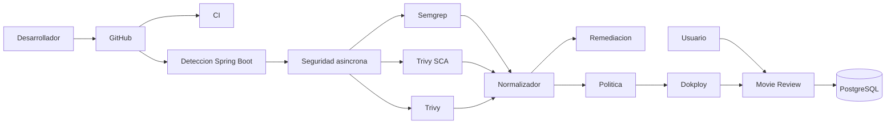

# Arquitectura del prototipo

La aplicacion es autonoma y no depende de servicios de negocio externos. En
local puede usar H2; en Dokploy se conectara a PostgreSQL mediante variables de
entorno.

La aplicacion de peliculas es el caso de validacion, pero no forma parte del
nucleo del analizador. El workflow detecta Maven o Gradle, la version de Java,
la raiz del proyecto y el Dockerfile. Movie Review utiliza ahora el paquete
generado por `DevSecOps Learning Initializer`, con un unico workflow de
seguridad y el codigo del panel en `.devsecops/dashboard`. El despliegue
reutiliza la autorizacion de ese paquete antes de llamar a Dokploy.

Si no existe un Dockerfile unico, el analisis SAST y SCA continua y la
tecnologia de contenedores se registra como no aplicable. Si se detectan varios
proyectos Spring Boot, el proceso se detiene para evitar seleccionar
un modulo de forma silenciosa y producir un informe incorrecto.
